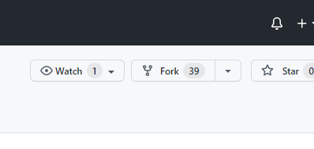
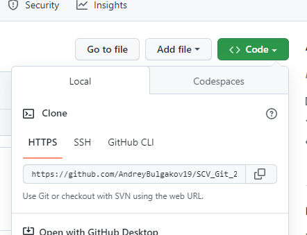
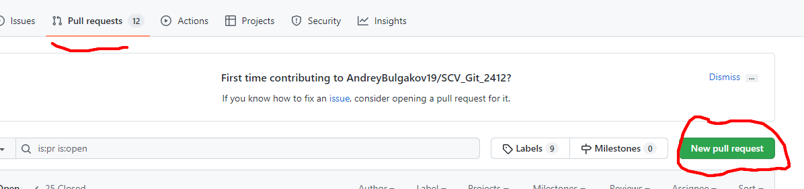

# Работа с Git
## 1. Проверка наличия установленного Git
В терминале выполнить команду `git version`

Если Git установлен, появится сообщение с информацией о версии программы. Иначе будет сообщение об ошибке.

### 2. Установка Git
Загружаем последнею версию Git с сайта https://git-scm.com/downloads. Устанавливаем с настройками по умолчанию.

# 3. Настройка Git

При первом использовании Git необходимо представиться. Для этого нужно ввести в терминале две команды: 
```
git config --global user.name «Ваше имя английскими буквами»
git config --global user.email ваша почта@example.com
```
## 4.  Инициализация локального репозитория
>Чтобы инициализировать локальную репозиторию нужно ввести команду 
```
git init
```

## 5.  Добавления файла для к следующему коммиту и коммит
>* Перед добавлением коммита можно уточнить, были ли какие-либо изменения. Для этого вводим команду 
```
git status
```
>>* Если выходит подобный ответ красного цвета, значит наш файл не добавлен к следующему коммиту: 


>>>* Чтобы добавить файл к следующему коммиту нужно в терминале ввести такую команду:
```
git add <Название файла (с расширением)>
```
* И только затем можно закоммитет изменения используя следующую команду: 
```
git commit -m "Комментарие"
```
* Также можно объяденить вышеупомянутые команды и использовать только:
```
git commit -am "Комментарие"
```
## 6. Разница между текущим файлом и закоммиченным файлом

Если мы забыли закоммечен ли наш файл или нет, то в терминале нужно набрать такую команду: 
```
git diff
```
В ответ к нам придет наши последние изменения. 
*Красный* - то, что удалено
*Зеленый* - то, что добавлено
## 7. История изменений
1) Для вывода на экран истории всех коммитов с их хеш-кодами нужно использовать команду **git log**, а для короткой истории нужно использовать команду `git log --oneline`

2) Чтобы перейти от одного коммита к другому
нужно пременить команду `git checkout 5af67c9`, где `5af67c9` - это начало хеш-кода

3) Чтобы вернуться к актуальному состоянию и продолжить работу достаточно ввести команду `git checkout master`, где `master` - это название ветки

## 8. Перемещение между сохранениями 

Для перемещение между сохранениями нужно использовать команду `git checkout <номер комита>`. Если же нужно вернуться обратно на последнее сохранение, то нужно ввести команду `git checkout master` либо ввести `git switch -`

## 9. Игнорирование файлов

Для того, чтобы исключить из отслеживания в репозитории определенные файлы или папки необходимо создать там файл ***.gitignore*** и записать в него их названия или шаблоны, соответствующие таким файлам или папкам в формате `*.jpg`

## 10. Создание веток в Git

Текущая ветка будет отмечена звёздочкой: **\*master**
Создать ветку можно командой:
```
git branch <имя новой ветки>
```
В результате создаһтся новый указатель на текущий коммит. 

Ветка в Git - это простой перемещатель указатель на один из коммитов, обычно последний в цепочке коммитов. 
По умолчанию имя основной ветки в Git это `master`.

## 11. Слияние веток и разрешение конфликтов 
Для слияния выбранной ветки с текущий нужно выполнить команду: 
```
git merge <названия выбранной ветки>
```

## 12. Удаление веток
Для удаление ветки нужно ввести следующую команду: `git branch -d <Название ветки>`, но при этом нужно находиться на другой ветки. Если находиться на той же ветке, что и собираемся удалить, то выйдет ошибка.

# Работа с удаленными репозиториями (свой)

1. Создать аккаунт на GitHub
2. Создать локальную репозиторий
3. Связать удалённый репозиторий с локальным

Добавить удаленный репозиторий к проекту:
```
git remout add <имя для репозитория> <url - адрес репозитория в сети>
```

# Работа с удаленным репозиториями (чужой)

1. Создать аккаунт на GitHub
2. Перейти по ссылке в чужую репозиторию
3. Нажать на кнопку `Fork` ниже скрин:



После чего чужая репозиторая скопируется

4. Скопировать ссылку нажав на кнопку `Code`



5. Затем VS Code открыть новую папку и запустить терминал. В терминале набрать команду: `git clone <ссылку на репозиторию>`. После этого у нас на локальном компьютере появится данная репозиторая

6. Далее нужно создать и перейти на новую ветку с помощью комбинированной команды `git checkout -b <название новой ветки>`. И уже после этого можно вносить свои изменения.

7. Чтобы сохранить все изменения нужно ввести команду `git commit -am <"Название коммита">` 

8. Следующий шаг - это отправка всех своих изменений с помощью команды `git push -u origin <Название ветки>`. Далее нужно зайти на GitHub нажать на кнопку `New pull requeste`



9. В открывшемся окне нужно выбрать свою новую ветку и нажать кнопку `Creat pull requeste`

10. Далее откроется новая страница, где можно будет оставить комментарий и отправить pull requeste хозяину репозитория

9. При следующей работе для работы на актуальной версии нам нужно отправить команду `git pull` и создать новую ветку с помощью комбинированной команды `git commit -am <"Название коммита">`